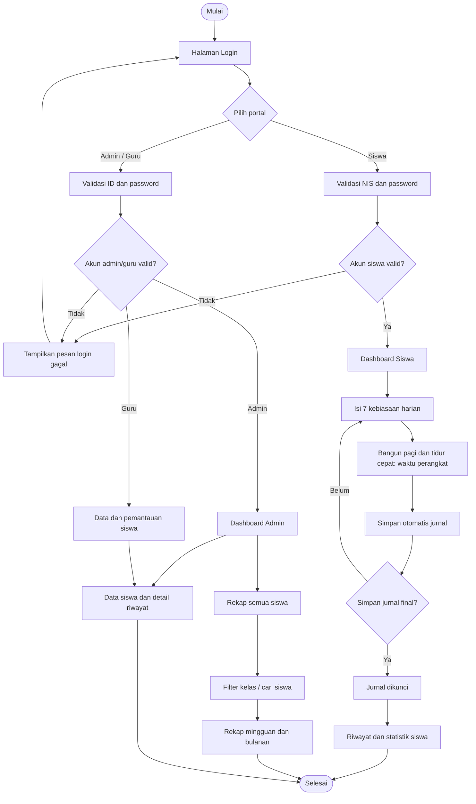
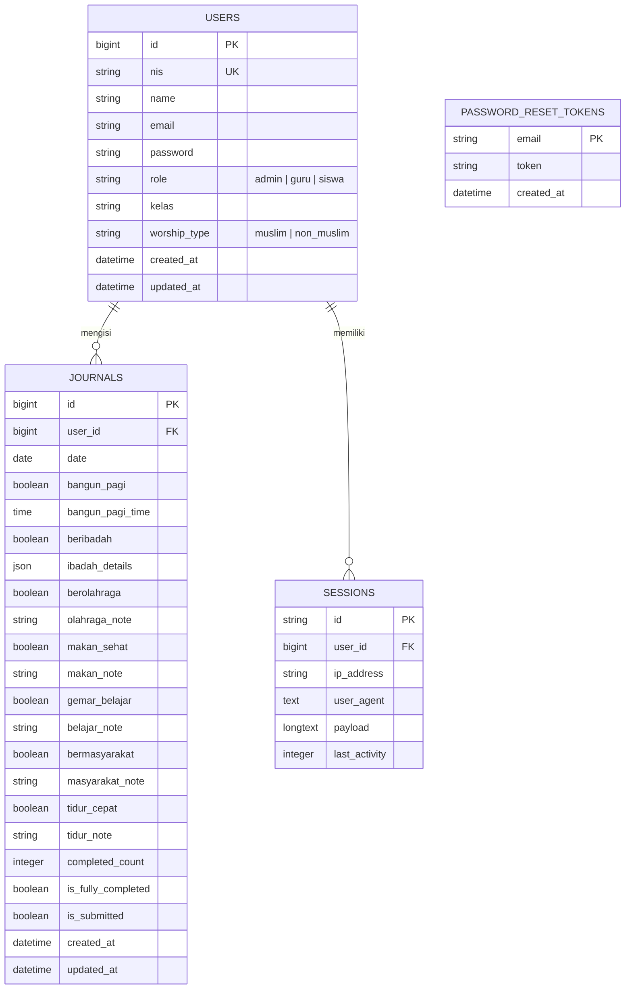

# Flowchart dan ERD Sistem Jurnal 7 Kebiasaan Baik

## Flowchart alur aplikasi

## ERD database inti

Catatan: satu siswa dapat memiliki banyak jurnal, tetapi hanya satu jurnal untuk setiap tanggal (`user_id` + `date`). Akun admin dan guru tidak mengisi jurnal; keduanya menggunakan data jurnal siswa untuk pemantauan dan rekap.
